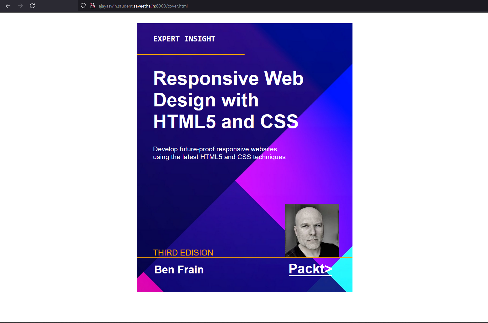

# PROGRAM
 ### HTML CODE.
 ```
<!DOCTYPE html>

<html lang="en">

<head>
    <meta charset="UTF-8">
    <meta http-equiv="X-UA-Compatible" content="IE=edge">
    <meta name="viewport" content="width=device-width, initial-scale=1.0">
    <title>coverpage</title>
    <link rel="stylesheet" href="static/css/cover.css">
    <style>
    main{
    background-color: rgb(58, 54, 54);
    background-image: url('static/images/book.png');
    height: 1000px;
    width:800px;
    margin-left: 500px;
}
    </style>
 </head>
<body>
    <main>
        <h4>EXPERT INSIGHT</h4>
        <hr id="start" color="orange">
        <h1>
            Responsive Web <br>
            Design with <br>
            HTML5 and CSS
        </h1>
        <p>Develop future-proof responsive websites <br>
        using the latest HTML5 and CSS techniques</p>

        
        <p id="edision">THIRD EDISION</p>
        <hr id="aj" color="orange">
        
        
           <p id="author">Ben Frain</p>
            <p id="packt"> <u> Packt> </u></p>
    
    
    </main>
   
</body>
</html>>
 ```

 ### css code.
 ```
 h4{
    color: white;
    font-style: sans-serif ;
    padding-left: 60px;
    padding-top: 40px;
    font-family:monospace;
    font-size: 30px;
}
#start{
    margin-right:400px;
}
h1{
    padding-left: 60px;
    color: white;
    font-size: 70px;
    font-family: sans-serif;
    
}
p{
    padding-left: 60px;
    padding-right: 10px;
    color: white;
    font-size: 25px;
    font-family: Arial, Helvetica, sans-serif;

}
#edision{
    color: orange;
    font-size: 30px;
    top: 300px;
    display:inline;
    position:relative;
}
#author{
    color:white;
    font-family:Arial, Helvetica, sans-serif;
    display:inline;
    position:relative;
    font-size:40px;
    font-weight:bold;
    bottom: 150px;
    right: 200px;
}
#packt{
    color: white;
    font-family:Arial, Helvetica, sans-serif;
    display:inline;
    position:relative;
    left: 40px;
    bottom: 150px;
    font-size:50px;
    font-weight:bold;
}
img{
    display:inline;
    position:relative;
    left: 550px;
    bottom: 210px;

}
#aj{
    margin-top:300px ;
}

 ```
# cover-page-design
